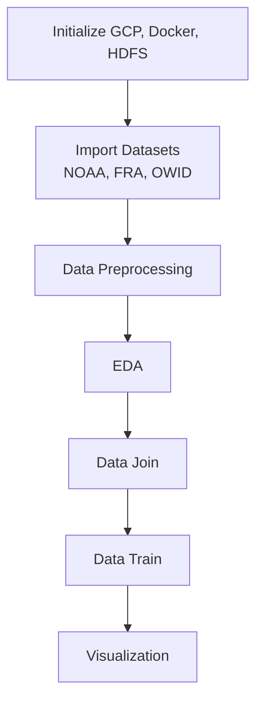

# Predicting Forest Carbon Stocks from Climate & CO2 Emissions Data

Forests absorb carbon and play a significant role in
combating climate change, but quantifying and predicting carbon sequestration
across countries and time is difficult given how fragmented and
multi-sourced the underlying data is. This project builds a predictive
analytics pipeline that estimates forest carbon stocks using climate
indicators and per-capita CO2 emissions data, implemented on cloud
infrastructure to support distributed data processing and model training.

Predicting forest carbon sequestration matters for informing green policy,
sustainability planning, and tracking climate targets. The goal here was to
integrate three independent datasets — NOAA GSOY (global annual temperature
and precipitation records), FAO FRA (forest area, biomass, and carbon stock
data), and Our World in Data (national CO2 emissions and per-capita
indicators) — preprocess and join them at scale, then train and evaluate
multiple predictive models using Spark MLlib.

## Data Sources

| Dataset | Source | Content |
|---|---|---|
| FAO FRA 2020 | [fra-data.fao.org](https://fra-data.fao.org/assessments/fra/2020/WO/data-download/) | Carbon in above-ground biomass (AGB) and below-ground biomass (BGB), by country, 1990–2020 |
| NOAA GSOY | [NOAA NCEI](https://www.ncei.noaa.gov/metadata/geoportal/rest/metadata/item/gov.noaa.ncdc:C00947/html) | Station-level annual climate summaries (temperature, precipitation, wind, degree-days) |
| Our World in Data | [ourworldindata.org](https://ourworldindata.org/co2-and-greenhouse-gas-emissions) | CO2 emissions per capita, by country and year |

None of these datasets are included in this repo due to size — download each
from the links above and place in `nbs/` (FAO Excel file and OWID CSV) or
`nbs/data/` (NOAA station files) before running the notebook.

## Architecture

The project's cloud infrastructure was built on Google Cloud Platform (GCP),
using Dataproc for the managed Spark cluster, Cloud Storage (GCS) for
dataset staging, and Compute Engine for on-demand training instances. Docker
was used to package a local development/testing environment (Hadoop HDFS,
Spark master/workers, and a Jupyter notebook) that mirrors the cluster
architecture, so the pipeline runs identically locally and in the cloud —
this repo's `docker-compose.yml` is that local environment.

HDFS served as the distributed backend storage layer for Spark's
computations. While the final joined dataset here (~190 countries × 5 years)
is modest in size, the pipeline was built on this distributed architecture
deliberately, to demonstrate a workflow that scales to much larger
multi-source, temporal datasets — e.g. station-level rather than
country-aggregated climate records — without requiring redesign.

Apache Spark MLlib was used for all modeling. Four algorithms were tested:
Linear Regression and Random Forest Regression for predicting forest carbon
stock directly, Gradient Boosted Trees to test for non-linear performance
gains, and K-Means Clustering (with PCA for visualization) to explore
climate-carbon relationship patterns across countries.

**Pipeline stages:**

1. **FAO FRA preprocessing** — parsed multi-header Excel sheets, dropped
   redundant columns, reshaped into a clean country × year carbon table for
   both AGB and BGB.
2. **NOAA GSOY preprocessing** — matched individual weather stations to
   countries via nearest-centroid geospatial lookup (no country field exists
   in the raw station data), aggregated station-year records into
   country-year climate averages, then bucketed into the five FAO target
   years (1990, 2000, 2010, 2015, 2020). Missing values were imputed first
   with the country mean, then the global mean as a fallback.
3. **OWID CO2 preprocessing** — filtered out aggregate/region rows (e.g.
   "World", "Europe", income-group labels), pivoted to one column per target
   year.
4. **EDA** — exploratory analysis on each cleaned dataset individually
   (distributions, trends over time, correlations) before joining.
5. **Data Join** — merged all three sources on `country` and `year`, summed
   AGB + BGB into a single `carbon_total` target.
6. **Data Train** — feature set of average temperature, average
   precipitation, average wind, and CO2 emissions per capita; 70/30
   train-test split; Linear Regression, Random Forest, Gradient Boosted
   Trees, and K-Means/PCA trained via Spark MLlib.
7. **Visualization** — model performance (predicted vs. actual, feature
   importance, cluster projections) visualized in the notebook.

All intermediate and final tables are cached to HDFS as Parquet.

### Cloud Resources

| Setting | Configuration |
|---|---|
| Instances | 1 |
| Usage Time | 20 hours |
| VM | n1-standard-4 (4 vCPUs, 16 GB RAM) |
| Persistent Disk | 50 GB |
| Region | Sydney (australia-southeast1) |
| Monthly Cost | $8.49 |

## Results

| Model | R² | RMSE |
|---|---|---|
| Linear Regression | 0.091 | 39.86 |
| Random Forest | **0.240** | **36.45** |
| Gradient Boosted Trees | 0.101 | 39.65 |

Random Forest was the best performer, roughly 2.5x the baseline R², and
identified CO2 per capita as the most important feature (~39% of split
importance), followed by wind and temperature. K-Means clustering + PCA were
used to explore structure in the feature space; clusters loosely separated
countries by climate/emissions profile but didn't map cleanly onto carbon
stock levels.

## Limitations & Why the Models Underperformed

An R² of 0.24 means the best model explains less than a quarter of the
variance in forest carbon stocks. A few likely reasons:

- **Feature-target mismatch.** National climate averages and per-capita CO2
  emissions are economic/atmospheric signals, not direct drivers of forest
  biomass. What actually determines a country's forest carbon — deforestation
  rate, forest age and species composition, soil type, land-use policy — isn't
  represented in the feature set at all.
- **Spatial resolution mismatch.** Forest carbon is highly local (it varies
  by region within a country), while every feature here is a single national
  average. This washes out the local signal FAO's own data is measuring.
- **Correlation, not mechanism.** CO2 per capita showing up as the top
  feature is plausible but suspect — it's more likely a proxy for
  industrialization or economic development that happens to correlate with
  certain forest profiles, not a causal driver of biomass carbon.
- **Small, noisy sample.** ~190 countries × 5 years, with real heterogeneity
  in forest types (boreal, tropical, temperate) lumped into one global model.

## Future Work / Next Steps

- Incorporate satellite-derived vegetation indices (e.g. NDVI) or
  higher-resolution land-cover data instead of country-level averages.
- Add deforestation/land-use-change features, which are more directly tied
  to biomass carbon than climate or emissions.
- Model forest biome types separately rather than pooling all countries into
  one global regression.
- Move from country-year rows to grid-cell rows (e.g. via Hansen Global
  Forest Change or NASA GEDI), which should more directly test whether
  resolution — not model choice — was the primary limitation here.

## Tech Stack

GCP (Dataproc, GCS, Compute Engine), Docker, Hadoop HDFS, PySpark, Spark
MLlib (`VectorAssembler`, `StandardScaler`, `LinearRegression`,
`RandomForestRegressor`, `GBTRegressor`, `KMeans`, `PCA`), pandas,
seaborn/matplotlib for EDA and visualization.